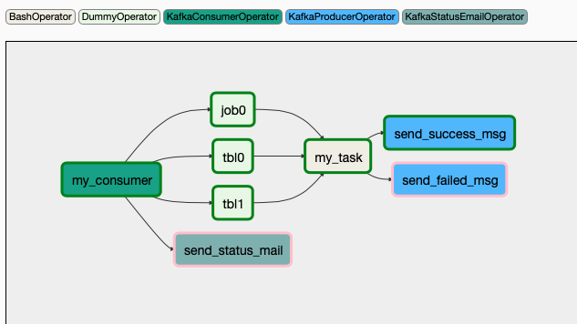

# Airflow Event Plugins For Kafka
This repository aimed to aggregate airflow plugins developed based on some specific ETL scenarios in the company within `plugins` folder, but only `event_plugins` with kafka and some related kafka operators available so far. Check [Event Plugins](docs/event_plugins.md) for more design details.<br/>
> To be short, the task in DAG can be triggered by multiple kafka messages and show status in UI. Check [example DAG](examples/)

## Usage
> Default airflow plugins are in `$AIRFLOW_HOME/plugins` folder (path is configured in `airflow.cfg`)
1. copy needed plugins within [plugins](plugins/) folder to `$AIRFLOW_HOME/plugins` folder. e.g.,
```
cp -r event_plugins $AIRFLOW_HOME/plugins
```
2. use it within DAGs

If using AIRFLOW, you might have a repository to aggregate all the airflow plugins developed by all the developers. It's recommended to use different folders to store different types of plugins

## Available plugins
> Only supports Python 2

* [Event Plugins](docs/event_plugins.md)
    * [KafkaConsumerOperator](docs/kafka_consumer.md): Works as a `Airflow Sensor` that can define multiple events to trigger jobs afterwards. It use dummy tasks to show the status of each events.
### Available Operators
* kafka_consumer
    * [KafkaConsumerOperator](docs/kafka_consumer.md)
    * send email for status of kafka consumer operator
        * [KafkaStatusEmailOperator](docs/kafka_email.md)
* kafka_producer
    * [KafkaProducerOperator](docs/kafka_producer.md#KafkaProducerOperator)
    * [KafkaProducerFromFileOperator](docs/kafka_producer.md#KafkaProducerFromFileOperator)
    * [KafkaProducerFromMergeFileOperator](docs/kafka_producer.md#KafkaProducerFromMergeFileOperator)

## How it looks like in DAG
[check the example](examples/)



## Requirement
### Installation
* `apache-airflow`
    * `croniter`
    * `python-dateutil`
    * `sqlalchemy`
* `confluent-kafka`
* `jinja`

### Test
* `pytest`
* `mock`
* `pytest-mock`
* `pytest-cov`
#### Run Tests
```
./run_test.sh
```
* It's available to add test arguments
```python
# show detail
./run_test.sh -vvv
# show coverage in console
./run_test.sh --cov-config=.coveragerc --cov=./
```

## TODO
* Maybe use unittest instead of pytest to follow testing framework in airflow ...
* Add more unit tests for error handling and some operators
* Add integration tests with DAG
* Support Python 3
* Event plugins with other source types
* Event plugins with multiple source types
