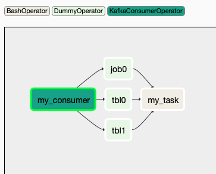
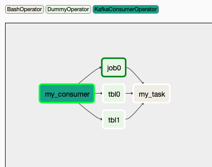
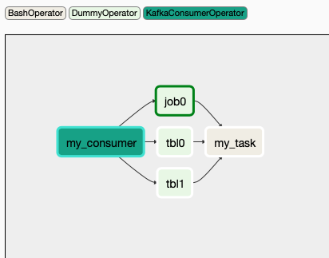
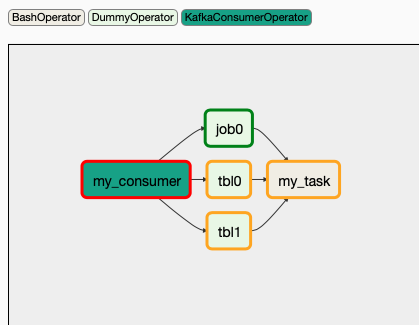
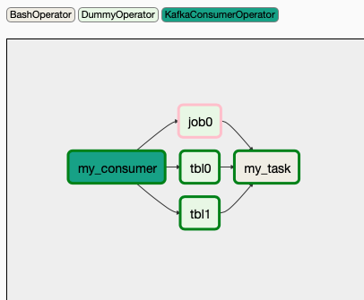

# Kafka Consumer Plugin
Available match topic:
* etl-finish
* job-finish

Note: you can define your own topic and corresponding match method

## Usage in DAG
```python
from airflow.operators.kafka_plugin import KafkaConsumerOperator

kafka_msgs = [
    {'frequency': 'D', 'topic': 'etl-finish', 'db': 'db0', 'table': 'table0', 'partition_values': "", 'task_id': "tbla"},
    {'frequency': 'D', 'topic': 'etl-finish', 'db': 'db1', 'table': 'table1', 'partition_values': "{{yyyymm|dt.format(format='%Y%m')}}", 'task_id': "tblb"},
    {'frequency': 'D', 'topic': 'job-finish', 'job_name': 'jn1', 'task_id': "joba"}
]

my_consumer = KafkaConsumerOperator(
    task_id='my_consumer',
    sensor_name=Optional[string], # use dag_id.task_id if not given, it's sensor identification in db, make sure it's unique.
    broker='localhost:9092',
    group_id='test',
    client_id='test',
    msgs=kafka_msgs,
    poke_interval=10,
    timeout=60,
    mark_success=True,
    soft_fail=False,
    mode='reschedule',
    debug_mode=False,
    session=Optional[Session]  # given if not using airflow db to store sensor status
)

# task_id should be same as value in kafka_msgs
A = DummyOperator(task_id='tbla')
B = DummyOperator(task_id='tblb')
C = DummyOperator(task_id='joba')

my_task = BashOperator(
    task_id='my_task',
    bash_command='echo task: "run_id={{ run_id }} | dag_run={{ dag_run }}"',
)

my_consumer >> [A, B, C]
[A, B, C] >> my_task
```

## How DAG with above code looks like
```
                      ╒═════════╕
                  +---|  tba a  |---+
                  |   | (dummy) |   |
                  |   ╘═════════╛   |
                  |                 |
╒═════════════╕   |   ╒═════════╕   |   ╒═════════╕
| my_consumer |---+---|  tba b  |---+---| my_task |
| (sensor)    |   |   | (dummy) |   |   | (bash)  |
╘═════════════╛   |   ╘═════════╛   |   ╘═════════╛
                  |                 |
                  |   ╒═════════╕   |
                  +---|  job a  |---+
                      | (dummy) |
                      ╘═════════╛
```

## DAG flow example
[example code](../examples/kafka_event_plugin.py)

When dag is triggered either by schedule or manually click from UI, KafkaConsumerOperator(sensor) would run like picture below:



During the running period, if kafka consumer received wanted message. For example, `job0`. The wanted message format of `job0` is like
```json
{"frequency": "D", "topic": "job-finish", "job_name": "jn0", "is_success": true, "task_id": "job0"}
```
When receiving message that match this wanted message, it will mark the dummy task which `task_id` equals to `job0` to success in the database (make sure `task_id` of dummy tasks equals to `task_id` of wanted messages). When the webserver read from the database, it will update the status of tasks on the UI. The result looks like picture below.


KafkaConsumerOperator(sensor) is still running since it hasn't received all the wanted messages.
* If `mode = poke`, it will sleep for `poke_interval` seconds and start to consume messages again.


* If `mode = reschedule`, it will schedule next round (now + `poke_interval` seconds) and raise reschedule exception. After now + `poke_interval` seconds, airflow scheduler will find this task ready to be executed (This is implemented in airflow sensor, more info could be found in [doc](https://airflow.apache.org/docs/stable/_modules/airflow/sensors/base_sensor_operator.html))



If not receiving all the wanted messages before `timeout`, KafkaConsumerOperator(sensor) will raise exception to leave to loop of sensor, and the task is finished.
* If `soft_fail = True`, raise `AirflowSensorTimeout('Snap. Time is OUT.')` and mark the task to *FAILED*.



* If `soft_fail = False`, raise `AirflowSkipException('Snap. Time is OUT.')` and mark the task to *SKIPPED*. (but not recommend since the status of DAG would be *SUCCESS* if all the tasks in DAG are either *SUCCESS* or *SKIPPED*). Get more information about [`soft_fail`](https://airflow.apache.org/docs/stable/_modules/airflow/sensors/base_sensor_operator.html)

The whole DAG is *FAILED* due to not received `tbl0` and `tbl1` messages today. If we confirms that these 2 messages are sent, we can leverage retry mechanism in airflow or manually trigger DAG again from UI.
> Since `job0` message has already received, when KafkaConsumerOperator(sensor) read from database, it will automatically mark it *SKIPPED*. The task after all dummy tasks should set `trigger_rule=TriggerRule.NONE_FAILED` to let it works with both *SUCCESS* and *SKIPPED* status from previous tasks. Check [Trigger Rules](https://airflow.apache.org/docs/stable/concepts.html?highlight=trigger#trigger-rules) for more information.

When receiving all wanted messages, the task will run and finish.



Note: If only received `job0` and DAG failed today. When it starts another dagrun tomorrow, KafkaConsumerOperator(sensor) would find out that `job0` is daily message from `frequency` fields and is timeout. It would clear what it has received so the dummy task with `task_id` equals to `job0` will not be marked to SKIPPED.
