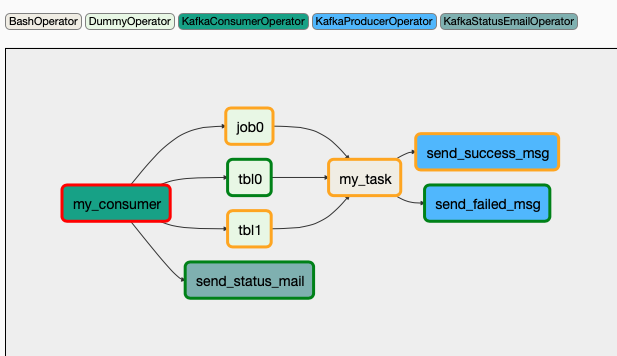

# How to test kafka_event_plugin DAG

### Modify `kafka_event_plugin.py`
1. set timezone to your local timezone
```python
local_tz = pendulum.timezone("<local timezone>")
```
2. set kafka broker
```python
broker = 'localhost:9092'
```

3. create `etl-finish` and `job-finish` topic in kafka

4. change `<email address>` in `KafkaStatusEmailOperator`
> also need to set `smtp` server in `airflow.cfg`
```python
send_status_email = KafkaStatusEmailOperator(
    task_id="send_status_mail",
    sensor_name="kafka_trigger_test.my_consumer",
    to="<email address>",
    trigger_rule=TriggerRule.ALL_FAILED
)
```

5. put the `kafka_event_plugin.py` into DAG folder and start airflow services. DAG should look like picture below but without status.

6. since the `schedule_interval` is `None`, manually trigger DAG from UI.

7. send testing messages and check if status of task in DAG changed.
    1. change value of `timestamp` and `partition_values` to the day you're testing
    2. produce the messages to kafka

```json
# topic: etl-finish
{"db": "db0", "table": "table0", "partition_fields": "", "partition_values": "", "timestamp": 1575190675}
{"db": "db1", "table": "table1", "partition_fields": "yyyymm", "partition_values": "201911", "timestamp": 1575190675}

# topic: job-finish
{"job_name": "jn0", "is_success": true, "duration": 10, "timestamp": 1575190675}
```

Note: if there're messages unreceived or not matched. It may look like picture below, and mail will be sent to the address.


### More information about the sensor
```python
# kafka sensor
my_consumer = KafkaConsumerOperator(
    # the name displayed in UI
    task_id='my_consumer',

    # use dag_id.task_id if not given, should be unique in database
    sensor_name="kafka_trigger_test.my_consumer",

    # parameters for kafka
    broker=broker,
    group_id='airflow-test',
    client_id='airflow-test',

    # wanted messages
    msgs=kafka_msgs,

    # the frequency to start kafka consumer and listening for messages
    poke_interval=10,

    # seconds, if not receiving messages within this peroids, it would timeout and mark the task failed
    timeout=120,

    # marking dummy tasks success or not
    mark_success=True,

    # skip the task without fail if set to True, check airflow sensor for more information
    soft_fail=False,
    # there's poke and reschedule mode for sensor, check airflow sensor for more information
    mode='reschedule',

    # print the db status or not
    debug_mode=True,
)
```
